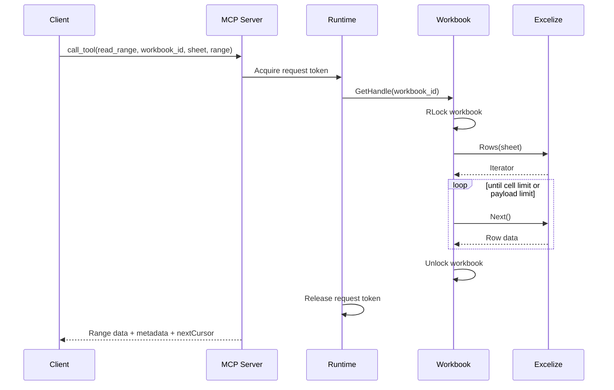
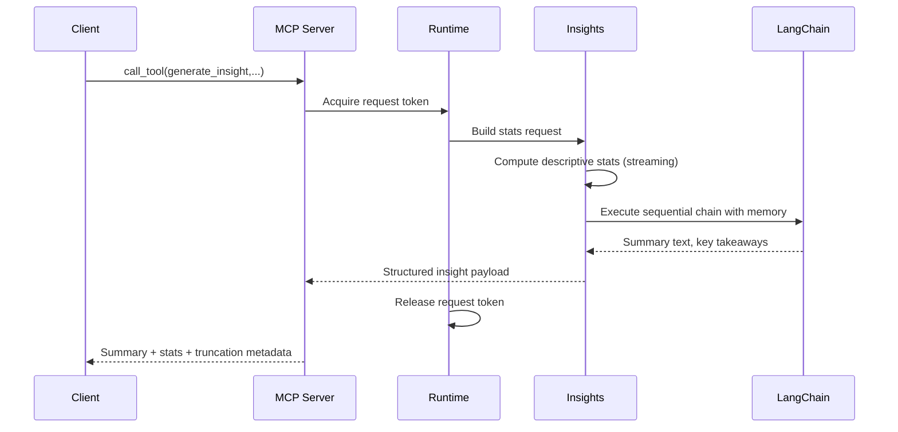

# Design Document

## Overview

The MCP Excel Analysis Server is a Go-based Model Context Protocol (MCP) service that exposes Excel-centric tools to large language model (LLM) assistants. The system minimizes token usage by streaming targeted slices, summaries, and metadata instead of entire workbooks. The implementation rests on three core libraries:

- **mark3labs/mcp-go** for protocol compliance, typed tool schemas, lifecycle hooks, and transport support.[^mcp-basics]
- **qax-os/excelize** for low-level workbook access, streaming readers, and concurrency-safe writes over large spreadsheets.[^excelize-rows]
- **tmc/langchaingo** (LangChainGo) for composing LLM-powered insight pipelines, memory management, and chain orchestration.[^lchain-arch]

Server-side state is strictly ephemeral: workbook handles are cached with time-based eviction, and every MCP request carries all identifiers required to satisfy Requirement 11. Configuration-driven guardrails enforce payload, concurrency, and directory boundaries.

## Architectural Goals

1. **Requirement Coverage** – Every tool and resource explicitly maps to requirements 1–16, with discoverable schemas and metadata defaults. 
2. **Streaming First** – Reads and writes prefer Excelize iterators and stream writers to cap memory usage (Req. 2, 3, 5, 8).
3. **Deterministic Concurrency** – Per-request goroutines, per-workbook locks, and server-wide semaphores satisfy Requirements 1, 6–8, 11–12.
4. **LLM-ready Insights** – Analytical operations generate concise summaries via LangChainGo chains while respecting payload limits (Req. 4, 9).
5. **Protocol Fidelity** – Typed tools, structured errors, and resource URIs mirror MCP expectations (Req. 14–16).

## High-Level Architecture

```mermaid
graph TD
    subgraph "AI Assistant Context"
        A[Claude / GPT-4]
        A --> B[MCP Client]
    end

    subgraph "MCP Excel Analysis Server"
        B --> C[Server Core (mcp-go)]
        C --> D[Tool & Resource Registry]
        C --> E[Concurrency & Rate Controller]
        D --> F[Workbook Lifecycle]
        D --> G[Analytics & Insight Engine]
        F --> H[Streaming IO (excelize)]
        G --> I[LangChainGo Chains]
        C --> J[Security & Policy]
        C --> K[Telemetry & Hooks]
    end

    subgraph "Storage"
        H --> L[Local Excel Files]
        F --> M[Ephemeral Handle Cache]
    end

    J -.-> L
    E -.-> F
    K -.-> {Metrics / Audit}
```

### Layered View

1. **Protocol Layer** – Builds `server.NewMCPServer` with tool, resource, and prompt capabilities plus panic recovery and hooks.[^mcp-basics]  
2. **Tool Layer** – Typed tool definitions and handlers cover workbook lifecycle, structure discovery, range operations, search, filtering, analytics, write/update, and insight generation.  
3. **Data Layer** – Streaming access via `Rows`, `Cols`, and `StreamWriter` iterators for predictable memory use.[^excelize-rows][^excelize-stream]  
4. **Insight Layer** – LangChainGo sequences orchestrate descriptive statistics + LLM summarization with configurable memory strategies.[^lchain-chains][^lchain-memory]
5. **Security Layer** – Path allow-listing, payload thresholds, and audit logging satisfy directory and compliance requirements.

## Component Breakdown

### Server Bootstrap (`cmd/server`)

```go
srv := server.NewMCPServer(
    "MCP Excel Analysis Server",
    versionFromBuild(),
    server.WithToolCapabilities(true),
    server.WithResourceCapabilities(true),
    server.WithPromptCapabilities(false),
    server.WithRecovery(),
    server.WithHooks(buildHooks(logger, metrics)),
    server.WithToolHandlerMiddleware(loggingMW.ToolMiddleware),
)
```

- `WithRecovery` stops handler panics from terminating the transport.[^mcp-basics]
- Hooks capture session lifecycle, request tracing, and audit emission.
- Middleware adds structured logging, rate limiting, and auth checks before tool execution.

### Concurrency & Rate Control (`internal/runtime`)

```go
type RuntimeLimits struct {
    MaxConcurrentRequests int
    MaxOpenWorkbooks      int
}

type RuntimeController struct {
    requests *semaphore.Weighted
    openWb   *semaphore.Weighted
}
```

- `requests` bounds total concurrent tool calls (Requirement 12.1). When saturation occurs, handlers either queue (blocking Acquire with timeout) or return `BUSY_RESOURCE`.
- `openWb` keeps workbook handles under `MaxOpenWorkbooks`; eviction strategy prefers least-recently-used handles managed by the workbook cache.
- Each tool handler receives the parent `context.Context` so cancellations propagate to Excelize iterators and LangChainGo chains.

### Tool & Resource Registry (`internal/registry`)

| Tool | Requirement(s) | Notes |
| --- | --- | --- |
| `open_workbook` | 1,10,13 | Validates path, size, format; registers handle with TTL. |
| `close_workbook` | 1 | Releases handle immediately. |
| `list_structure` | 2 | Returns sheet names, dimensions, header row without data. |
| `preview_sheet` | 2.3, 2.4 | Streams first _n_ rows via `Rows`, configurable preview length. |
| `read_range` | 3,14 | Uses capped iterators, returns pagination cursor. |
| `write_range` | 6 | Applies writes with transactional temp sheet + `StreamWriter` then swap. |
| `apply_formula` | 7 | Batch applies formulas; supports rollback on failure. |
| `filter_data` | 8 | Executes predicate engine with row streaming and stable cursors. |
| `compute_statistics` | 4 | Calculates stats up to configured cell limits, streaming columns. |
| `search_data` | 5 | Utilizes `SearchSheet` with optional column filters.[^excelize-rows] |
| `generate_insight` | 9 | Pipes structured stats into LangChainGo sequential chain for summary. |
| `metadata_only` | 2.4, 15 | Returns workbook limits, config, and usage metadata. |

Tool schemas are declared with typed handlers to leverage automatic validation:[^mcp-typed]

```go
type ReadRangeInput struct {
    WorkbookID string `json:"workbook_id" jsonschema:"required"`
    Sheet      string `json:"sheet" jsonschema:"required"`
    Range      string `json:"range" jsonschema:"required"`
    Format     string `json:"format" jsonschema:"enum=json,enum=csv,enum=table,default=json"`
}

readRangeTool := mcp.NewTool(
    "read_range",
    mcp.WithDescription("Return a bounded cell range with pagination metadata"),
    mcp.WithInputSchema[ReadRangeInput](),
    mcp.WithOutputSchema[RangeEnvelope](),
)

srv.AddTool(readRangeTool, mcp.NewTypedToolHandler(handleReadRange))
```

Resources complement tools to expose previews, active configuration, and cached insight artifacts:[^mcp-res]

- `excel://workbooks/{id}/structure` → JSON metadata
- `excel://workbooks/{id}/preview/{sheet}` → Markdown-or-CSV snapshot
- `excel://config/limits` → Effective limits advertised to clients (Requirement 15.2)

During startup, the registry publishes both tool catalog and resource catalog so `list_tools` and `list_resources` reflect schemas, defaults, and payload ceilings (Requirement 16.1–16.2).

### Workbook Lifecycle & Streaming IO (`internal/workbook`)

```go
type WorkbookManager struct {
    handles *sync.Map
    lru     *list.List
    mu      sync.Mutex
    ttl     time.Duration
    limits  RuntimeLimits
}
```

- `OpenWorkbook` validates path + size, then loads `excelize.File` with `excelize.OpenFile` using optional password settings (Requirement 10). On success it stores a handle keyed by UUID with expiration metadata.  
- Reads use `Rows` / `Cols` iterators for streaming and call `Close()` when done to release temp files.[^excelize-rows]
- Writes rely on `StreamWriter` with ascending row order requirements and final `Flush()` to commit changes.[^excelize-stream]
- `AccessMutex` is an `RWMutex` per handle: concurrent reads share the lock, writes obtain exclusive access (Requirement 12.2–12.3).
- Idle cleanup runs on ticker to close files past `WorkbookIdleTimeout` (Requirement 1.3).

Pagination cursors capture sheet name, offset, and timestamp to provide stable iteration even with concurrent writes (Requirement 14.1).

### Analytics & Insight Engine (`internal/insights`)

The insight pipeline combines deterministic statistics with language-model summaries while keeping token budgets under control.

```go
statsChain := chains.NewSequentialChain([]chains.Chain{
    chains.NewLLMChain(llm, statsPrompt),
    chains.NewLLMChain(llm, insightPrompt),
})

memory := memory.NewTokenBufferMemory(
    memory.WithTokenLimit(limits.InsightTokenBudget),
)
conversation := chains.NewConversationChain(llm, memory)
```

- Selects memory strategy (token-buffer vs. summary) per workload; LangChainGo warns against sharing memory instances across conversations, so each insight job obtains a fresh memory object.[^lchain-memory]
- Chains execute with `context.Context` deadlines derived from `OperationTimeout` to enforce predictable runtimes.[^lchain-arch]
- LLM calls use fallback responses when upstream providers fail, satisfying Requirement 9.3.

### Security, Validation & Audit (`internal/security`)

- `SecurityManager.ValidateFilePath` ensures resolved absolute paths stay within `AllowedDirectories` (Requirement 13).  
- `Validator.ValidateRange` parses A1 ranges, verifying limits before hitting Excelize to prevent expensive operations failing late.  
- Audit middleware emits `AuditEvent` entries with start/end timestamps, workbook IDs, and error codes; events feed metrics for anomaly detection.

### Telemetry & Observability (`internal/telemetry`)

- Hooks capture `OnServerStart`, `OnServerStop`, `OnToolCall`, and `OnResourceRead` per mcp-go guidance, updating Prometheus counters and histograms for latency profiling.[^mcp-advanced]
- Structured logs via `slog` include request IDs, session IDs, workbook IDs, and concurrency counters.  
- Optional notifications use `Server.SendNotificationToAllClients` for long-running jobs (e.g., streaming progress), echoing best practices from mcp-go advanced docs.[^mcp-advanced]

## Data Flow Scenarios

### Range Read with Pagination



### Insight Generation



## Pagination Cursors

### Goals

- Provide stable, resumable pagination across tools (read_range, preview_sheet, search_data, filter_data) even under concurrent writes.
- Keep tokens opaque to clients while allowing the server to evolve fields safely.
- Ensure responses always include `total`, `returned`, `truncated`, and `nextCursor` (Requirement 14.1).

### Token Format

- Cursor is an opaque, URL-safe base64-encoded JSON object (compact/minified). Example (JSON before encoding):

  {
    "v": 1,
    "wid": "<workbook_id>",
    "s": "Sheet1",
    "r": "A1:D100",
    "u": "cells",          // unit: "cells" | "rows"
    "off": 200,             // offset in the chosen unit
    "ps": 1000,             // page size in unit
    "wbv": 7,               // workbook mutation version snapshot
    "iat": 1726600000,      // issued-at (unix seconds)
    // tool-specific fields (optional)
    "qh": "<query_hash>",  // search_data
    "ph": "<pred_hash>"    // filter_data
  }

- Fields are intentionally short to minimize payload overhead. The token is treated as opaque by clients.

### Tool Semantics

- All paginated tools accept an optional `cursor` input. When present, it takes precedence over other positional inputs (e.g., `sheet`, `range`, `max_cells`).
- Tools emit `nextCursor` using the opaque format. When no further data remains, `nextCursor` is omitted and `truncated=false`.
- Units by tool:
  - read_range: `u=cells` (row-major), offset counts cells written so far.
  - preview_sheet: `u=rows`, offset counts rows emitted so far.
  - search_data and filter_data: `u=rows` for result rows; include `qh`/`ph` to guarantee the cursor binds to the same parameters.

### Stability Under Writes

- The workbook manager maintains a per-handle mutation counter (`wbv`). Write tools (write_range, apply_formula, and future mutators) increment this counter upon successful commit.
- Cursors embed the `wbv` snapshot at issuance. On resume, if the current handle version differs from the cursor `wbv`, the server SHALL return `CURSOR_INVALID` with guidance to restart the page or re-run the query narrowed in scope. This satisfies Requirement 14.1 by avoiding duplicates/gaps after mid-stream writes.

### Resume Computation

- read_range (u=cells):
  - Given normalized `A1:D100` → (x1,y1,x2,y2) and `off` cells, compute:
    - cols = x2 - x1 + 1
    - startRow = y1 + off / cols
    - startCol = x1 + off % cols
  - Iterate row-major from (startCol,startRow), honoring page size (`ps`) and global caps.
- preview_sheet (u=rows): resume at `y = header_row + 1 + off` and continue for `ps` rows.
- search/filter: resume from result index `off`, recomputing matches deterministically for the same query/predicate hash.

### Backward Compatibility

- Legacy query-string cursor emission has been removed. Tools emit and accept only opaque, URL-safe base64 JSON cursors. Clients relying on the legacy `sheet=&range=&offset=` format must migrate to opaque cursors.

### Security & Size

- Cursors MUST NOT include filesystem paths or absolute locations; only the workbook handle ID is included.
- Cursor lifetime is tied to handle TTLs; servers MAY reject stale cursors after handle expiration with `CURSOR_INVALID`.
- Encoding is URL-safe base64 to avoid escaping concerns in transports and logs.

### Error Semantics

- `CURSOR_INVALID`: Returned when the cursor cannot be decoded, validation fails, the workbook handle is missing/expired, or the embedded `wbv` no longer matches the current handle version.
- Responses include actionable guidance: reopen/refresh the workbook, restart pagination, or narrow scope.

## Implementation Guidelines

### Tool Registration & Validation

1. Use typed tool handlers (`mcp.NewTypedToolHandler`) so `jsonschema` tags enforce required and bounded parameters automatically.[^mcp-typed]
2. Provide `mcp.WithDescription`, defaults, enums, and unit annotations to make `list_tools` self-documenting (Requirement 16.1).
3. Wrap handler logic with middleware that enforces context deadlines, concurrency quotas, and audit logging before acquiring workbook locks.

### Resource Exposure

1. Call `server.AddResource` for configuration URIs, dynamic previews, and cached insights.[^mcp-res]  
2. Resource handlers must honour the same security and limit checks as tools and return precise MIME types, enabling clients to reason about payloads (Requirement 2.4, 15.2).

### Excelize Usage Patterns

1. Prefer `f.Rows(sheet)` / `rows.Columns()` for large reads; close the iterator to release temp files.[^excelize-rows]
2. Use `StreamWriter` when writing many cells or formulas; maintain ascending row order and call `Flush()` before closing the workbook.[^excelize-stream]
3. For search operations, call `f.SearchSheet(sheet, value, regex)` and post-filter results to honour match limits (Requirement 5.1–5.2).
4. Always apply per-workbook RW locks around Excelize calls because the struct is not inherently thread safe for concurrent writes.

### LangChainGo Integration

1. Follow the architecture guideline: pass `context.Context` into every chain or LLM call and honour cancellations.[^lchain-arch]
2. Choose memory implementation per workload (buffer, token buffer, summary) and never share memory between chains, per LangChainGo best practices.[^lchain-memory]
3. Compose insight workflows with sequential chains or conversation chains for reuse; prefer deterministic prompts that respect the configured character cap (Requirement 9.1–9.2).[^lchain-chains]

### Error Handling

1. Validation failures return `mcp.NewToolResultError` with user-facing guidance; map to internal `MCPError` catalog for consistent `nextSteps` (Requirement 14.2, 14.4).
2. System faults bubble up as Go errors; middleware transforms them into `OPERATION_TIMEOUT`, `BUSY_RESOURCE`, or `CORRUPT_WORKBOOK` codes with retry advice.
3. Retryable operations (read, search) are idempotent; write operations advertise idempotency status through response metadata to support safe retries (Requirement 11.3–11.4).

### Configuration & Limits

- Defaults ship in YAML but can be overridden via CLI or env vars. Startup validation rejects invalid overrides with structured configuration errors (Requirement 15.3).
- Effective limits (`MaxPayloadSize`, `DefaultRowLimit`, concurrency ceilings) are surfaced through the metadata resource and in tool descriptions.

## Testing Strategy

1. **Unit Tests** – Cover tool handlers with table-driven tests for validation, concurrency, and error mapping. Mock Excelize interfaces for edge cases.
2. **Concurrency Tests** – Simulate simultaneous reads/writes using Go race detector and wait groups to assert locking behaviour (Requirement 12).
3. **Streaming Tests** – Use large fixture files to ensure iterators keep memory usage below thresholds and pagination cursors remain stable (Requirement 3, 14.1).
4. **LLM Pipeline Tests** – Mock LangChainGo chains to validate fallback logic when providers fail; include token budget enforcement.
5. **Protocol Tests** – Exercise `list_tools`, `list_resources`, and error payloads using the MCP client harness.

## Performance & Scaling

- Track metrics for request latency, iterator throughput, workbook cache hit ratio, and LangChain invocation time.  
- Use connection pooling for outbound HTTP clients (LLMs) as in LangChainGo architecture guidance.[^lchain-arch]
- Support horizontal scaling by running multiple stateless server replicas; long-running workbook handles live in-process only.

## Security & Compliance

- Enforce directory allow-list and denied patterns before opening files (Requirement 13.1–13.2).
- Require explicit opt-in for write/transform tools; optionally gate them behind authentication middleware.
- Sanitize user-supplied formulas, filters, and regex patterns to prevent injection attacks.  
- Log all failures with workbook IDs and error codes for audit trails.

## Deployment Considerations

- Primary transport is `ServeStdio` for local MCP clients; `StreamableHTTPServer` is available for remote deployments with TLS (Requirement 15).  
- Container image builds with multi-stage Dockerfile, running as non-root and mounting Excel directories read-only unless write tools are enabled.
- Provide sample systemd unit and health probe endpoints (if HTTP transport) for operations teams.

## Repository, CI, and Releases

- Repository: `https://github.com/vinodismyname/mcpxcel` (MIT licensed).
- Branching: `main` is protected; changes land via PRs only.
- CI: `.github/workflows/ci.yml` runs `make lint`, `make test`, and `make test-race` on PRs and `main`.
- Versioning: SemVer tags (e.g., `v0.1.0`) originate from `main`. Tags trigger a GitHub Release with autogenerated notes.
- Go Module: `github.com/vinodismyname/mcpxcel`. Maintain import path consistency, and add `/v2` suffix on major bumps.
- Developer workflow: branch from `main` → implement + docs → open PR → green CI → squash-merge → `git pull` on `main` → `git tag vX.Y.Z` (if releasing) → `gh release create vX.Y.Z`.

## References

[^mcp-basics]: mark3labs/mcp-go, "Server Basics" – `server.NewMCPServer`, capabilities, recovery middleware. <https://github.com/mark3labs/mcp-go/blob/main/www/docs/pages/servers/basics.mdx>
[^mcp-typed]: mark3labs/mcp-go, "Advanced Server Features" – typed tools and validation. <https://github.com/mark3labs/mcp-go/blob/main/www/docs/pages/servers/advanced.mdx>
[^mcp-res]: mark3labs/mcp-go, "Implementing Resources" – resource registration patterns and error handling. <https://github.com/mark3labs/mcp-go/blob/main/www/docs/pages/servers/resources.mdx>
[^mcp-advanced]: mark3labs/mcp-go, "Advanced Server Features" – hooks, middleware, notifications. <https://github.com/mark3labs/mcp-go/blob/main/www/docs/pages/servers/advanced.mdx>
[^excelize-rows]: qax-os/excelize documentation, "Worksheet" – streaming row and column iterators, concurrency guarantees. <https://github.com/xuri/excelize-doc/blob/master/en/sheet.md>
[^excelize-stream]: qax-os/excelize documentation, "Streaming write" – `StreamWriter` usage and constraints. <https://github.com/xuri/excelize-doc/blob/master/en/stream.md>
[^lchain-arch]: tmc/langchaingo documentation, "Architecture" – context-first design, concurrency, and error handling. <https://github.com/tmc/langchaingo/blob/main/docs/docs/concepts/architecture.md>
[^lchain-chains]: tmc/langchaingo documentation, "Chains" – sequential execution and Call/Run/Predict helpers. <https://github.com/tmc/langchaingo/blob/main/docs/docs/modules/chains/index.mdx>
[^lchain-memory]: tmc/langchaingo documentation, "Memory" – memory types, isolation guidance, best practices. <https://github.com/tmc/langchaingo/blob/main/docs/docs/modules/memory/index.mdx>
