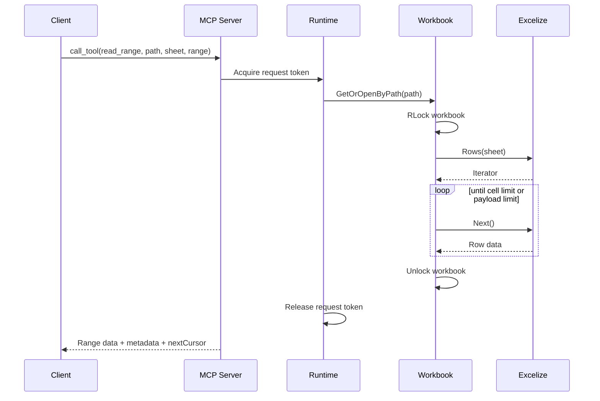
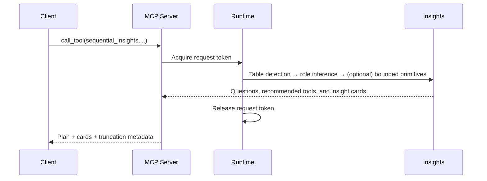

# Design Document

## Overview

The MCP Excel Analysis Server is a Go-based Model Context Protocol (MCP) service that exposes Excel-centric tools to AI assistants. The system minimizes token usage by streaming targeted slices, summaries, and metadata instead of entire workbooks. The implementation rests on two core libraries plus an internal insights engine:

- **mark3labs/mcp-go** for protocol compliance, typed tool schemas, lifecycle hooks, and transport support.[^mcp-basics]
- **qax-os/excelize** for low-level workbook access, streaming readers, and concurrency-safe writes over large spreadsheets.[^excelize-rows]
- **internal/insights** for domain-neutral planning and deterministic primitives (no server-embedded LLM)

Server design is path-first and stateless from a client perspective: tools take a canonical file `path`, and pagination cursors carry all information needed to resume without transient IDs. Internally, a TTL-based handle cache keyed by canonical path is used only as an optimization. Configuration-driven guardrails enforce payload, concurrency, and directory boundaries.

## Architectural Goals

1. **Requirement Coverage** – Every tool maps to requirements 1–15 and 16.1, with discoverable schemas and metadata defaults. 
2. **Streaming First** – Reads and writes prefer Excelize iterators and stream writers to cap memory usage (Req. 2, 3, 5, 8).
3. **Deterministic Concurrency** – Per-request goroutines, per-workbook locks, and server-wide semaphores satisfy Requirements 1, 6–8, 11–12.
4. **LLM-ready Insights** – Analytical operations provide domain-neutral planning and deterministic primitives; clients (LLMs) orchestrate execution and narrative (Req. 4, 9).
5. **Protocol Fidelity** – Typed tools and structured errors mirror MCP expectations (Req. 14–16.1).

## High-Level Architecture

```mermaid
graph TD
    subgraph "AI Assistant Context"
        A[Claude / GPT-4]
        A --> B[MCP Client]
    end

    subgraph "MCP Excel Analysis Server"
        B --> C[Server Core (mcp-go)]
        C --> D[Tool Registry]
        C --> E[Concurrency & Rate Controller]
        D --> F[Workbook Lifecycle]
        D --> G[Sequential Insights Engine]
        F --> H[Streaming IO (excelize)]
        G --> I[Planning + Deterministic Primitives]
               
        C --> J[Security & Policy]
        C --> K[Logging Hooks]
    end

    subgraph "Storage"
        H --> L[Local Excel Files]
        F --> M[Ephemeral Handle Cache]
    end

    J -.-> L
    E -.-> F
    K -.-> {Request Logging}
```

### Layered View

1. **Protocol Layer** – Builds `server.NewMCPServer` with tool capabilities plus panic recovery and hooks.[^mcp-basics]  
2. **Tool Layer** – Typed tool definitions and handlers cover workbook lifecycle, structure discovery, range operations, search, filtering, analytics, write/update, and insight generation.  
3. **Data Layer** – Streaming access via `Rows`, `Cols`, and `StreamWriter` iterators for predictable memory use.[^excelize-rows][^excelize-stream]  
4. **Insight Layer** – Sequential Insights planning with bounded, deterministic primitives (variance, composition, concentration, funnel, quality). Clients (LLMs) ask clarifying questions and narrate.
5. **Security Layer** – Path allow-listing, payload thresholds, and audit logging satisfy directory and compliance requirements.

## Component Breakdown

### Server Bootstrap (`cmd/server`)

```go
srv := server.NewMCPServer(
    "MCP Excel Analysis Server",
    versionFromBuild(),
    server.WithToolCapabilities(true),
    server.WithPromptCapabilities(false),
    server.WithRecovery(),
    server.WithHooks(buildHooks(logger)),
    server.WithToolHandlerMiddleware(loggingMW.ToolMiddleware),
)
```

- `WithRecovery` stops handler panics from terminating the transport.[^mcp-basics]
- Hooks capture session lifecycle and request tracing via logging.
- Middleware adds structured logging, rate limiting, and auth checks before tool execution.

### Concurrency & Rate Control (`internal/runtime`)

```go
type RuntimeLimits struct {
    MaxConcurrentRequests int
    MaxOpenWorkbooks      int
}

type RuntimeController struct {
    requests *semaphore.Weighted
    openWb   *semaphore.Weighted
}
```

- `requests` bounds total concurrent tool calls (Requirement 12.1). When saturation occurs, handlers either queue (blocking Acquire with timeout) or return `BUSY_RESOURCE`.
- `openWb` keeps workbook handles under `MaxOpenWorkbooks`; eviction strategy prefers least-recently-used handles managed by the workbook cache.
- Each tool handler receives the parent `context.Context` so cancellations propagate to Excelize iterators.

### Tool Registry (`internal/registry`)

| Tool | Requirement(s) | Notes |
| --- | --- | --- |
| `list_structure` | 2 | Returns sheet names, dimensions, header row without data. |
| `preview_sheet` | 2.3, 2.4 | Streams first _n_ rows via `Rows`, configurable preview length. |
| `read_range` | 3,14 | Uses capped iterators, returns pagination cursor. |
| `write_range` | 6 | Applies writes with transactional temp sheet + `StreamWriter` then swap. |
| `apply_formula` | 7 | Batch applies formulas; supports rollback on failure. |
| `filter_data` | 8 | Executes predicate engine with row streaming and stable cursors. |
| `compute_statistics` | 4 | Calculates stats up to configured cell limits, streaming columns. |
| `search_data` | 5 | Utilizes `SearchSheet` with optional column filters.[^excelize-rows] |
| `sequential_insights` | 9,14 | Planning tool returning questions, recommended tool calls, and insight cards; can run bounded primitives. |
| `detect_tables` | 2 | Detects multiple table regions (ranges) within a sheet; returns Top‑K candidates. Supports `header_sample_rows` and `header_sample_cols` (default 2 x 12, max 5 x 32) to include a compact header sample from each candidate. |
| `profile_schema` | 4 | Role inference (measure/dimension/time/id/target) + data quality checks. |
| `composition_shift` | 4 | Quantifies share changes and net effect on KPI (±5pp threshold). |
| `concentration_metrics` | 4 | Computes Top-N share and HHI bands. |
| `funnel_analysis` | 4 | Stage detection from column names/hints; step and cumulative conversion; bottleneck cards. |
| `metadata_only` | 2.4, 15 | Returns workbook limits, config, and usage metadata. |

Tool schemas are declared with typed handlers to leverage automatic validation:[^mcp-typed]

```go
type ReadRangeInput struct {
    Path   string `json:"path" jsonschema:"description=Canonical Excel file path,required"`
    Sheet  string `json:"sheet" jsonschema:"required"`
    Range  string `json:"range" jsonschema:"required"`
    Format string `json:"format" jsonschema:"enum=json,enum=csv,enum=table,default=json"`
}

readRangeTool := mcp.NewTool(
    "read_range",
    mcp.WithDescription("Return a bounded cell range with pagination metadata"),
    mcp.WithInputSchema[ReadRangeInput](),
    mcp.WithOutputSchema[RangeEnvelope](),
)

srv.AddTool(readRangeTool, mcp.NewTypedToolHandler(handleReadRange))
```

During startup, the registry publishes the tool catalog so `list_tools` reflects schemas, defaults, and payload ceilings (Requirement 16.1).

#### Sequential Insights (Planning-Only default)

The `sequential_insights` tool provides deterministic, domain‑neutral planning without a server‑embedded LLM. Inputs include `objective`, `path|cursor`, optional `hints`/`constraints`, and step tracking fields. Outputs contain:
- `current_step` summary
- `recommended_tools[]` with `tool_name`, `confidence` (0–1), `rationale`, `priority`, and `suggested_inputs`
- `questions[]` for clarification (e.g., multiple sheets, missing time/measure hints)
- `insight_cards[]` (empty in planning‑only mode)
- `meta` with effective runtime limits and `planning_only=true`

Cursor semantics take precedence over `path` when provided. Bounded compute primitives remain gated by config and are not enabled by default for this phase.

### Workbook Access & Streaming IO (`internal/workbook`)

```go
type WorkbookManager struct {
    handles *sync.Map
    lru     *list.List
    byPath  *sync.Map // canonical path -> handle id
    mu      sync.Mutex
    ttl     time.Duration
    limits  RuntimeLimits
}
```

- `GetOrOpenByPath` validates and canonicalizes `path`, then loads `excelize.File` with `excelize.OpenFile` using optional password settings (Requirement 10). On success it stores a handle keyed by UUID and indexes it by canonical path.  
- Reads use `Rows` / `Cols` iterators for streaming and call `Close()` when done to release temp files.[^excelize-rows]
- Writes rely on `StreamWriter` with ascending row order requirements and final `Flush()` to commit changes.[^excelize-stream]
- `AccessMutex` is an `RWMutex` per handle: concurrent reads share the lock, writes obtain exclusive access (Requirement 12.2–12.3).
- Idle cleanup runs on ticker to close files past `WorkbookIdleTimeout` (Requirement 1.3).

Pagination cursors capture sheet name, offset, and timestamp to provide stable iteration even with concurrent writes (Requirement 14.1).

### Sequential Insights Engine (`internal/insights`)

The insights engine provides a planning loop and bounded, deterministic primitives:

- Planning: takes objective + context; returns questions, recommended tool calls with confidence/rationale, and insight cards.
- Table Detection: streaming scan of non-empty blocks; identifies rectangular regions separated by blank rows/columns; ranks candidates by header uniqueness/text-likeness and region size; returns Top‑K candidates with header preview and confidence.
- Primitives: change over time, variance to baseline/target, driver ranking (Top ± movers), composition shift, concentration (Top-N share, HHI bands), robust outliers (modified z-score), funnel analysis, and data quality checks.
- Safety: streaming algorithms, Top-N capping with "Other", conservative thresholds, explicit assumptions, and truncation metadata.

### Security, Validation & Audit (`internal/security`)

- `SecurityManager.ValidateFilePath` ensures resolved absolute paths stay within `AllowedDirectories` (Requirement 13).  
- `Validator.ValidateRange` parses A1 ranges, verifying limits before hitting Excelize to prevent expensive operations failing late.  
- Audit middleware emits `AuditEvent` entries with start/end timestamps, canonical paths, and error codes.


## Data Flow Scenarios

### Range Read with Pagination



### Sequential Insights



## Pagination Cursors

### Goals

- Provide stable, resumable pagination across tools (read_range, preview_sheet, search_data, filter_data) even under concurrent writes.
- Keep tokens opaque to clients while allowing the server to evolve fields safely.
- Ensure responses always include `total`, `returned`, `truncated`, and `nextCursor` (Requirement 14.1).

### Token Format

- Cursor is an opaque, URL-safe base64-encoded JSON object (compact/minified). Example (JSON before encoding):

  {
    "v": 1,
    "pt": "/abs/canonical/file.xlsx", // canonical path
    "s": "Sheet1",
    "r": "A1:D100",
    "u": "cells",          // unit: "cells" | "rows"
    "off": 200,             // offset in the chosen unit
    "ps": 1000,             // page size in unit
    "mt": 1726600000,      // file modification time (unix seconds)
    "iat": 1726600000,      // issued-at (unix seconds)
    // tool-specific fields (optional)
    "qh": "<query_hash>",  // search_data binding hash
    "ph": "<pred_hash>",   // filter_data binding hash
    // search_data provenance (for deterministic cursor-only resume)
    "q":  "<query>",       // original query string
    "rg": true,             // regex flag
    "cl": [1,6]             // optional column filter (1-based)
    // filter_data provenance (for deterministic cursor-only resume)
    "p":  "<predicate>",   // original predicate expression
    "cl": [2,4]             // optional column scope (1-based)
  }

- Fields are intentionally short to minimize payload overhead. The token is treated as opaque by clients.

### Tool Semantics

- All paginated tools accept an optional `cursor` input. When present, it takes precedence over other positional inputs (e.g., `path`, `sheet`, `range`, `max_cells`).
- Tools emit `nextCursor` using the opaque format. When no further data remains, `nextCursor` is omitted and `truncated=false`.
- Units by tool:
  - read_range: `u=cells` (row-major), offset counts cells written so far.
  - preview_sheet: `u=rows`, offset counts rows emitted so far.
  - search_data and filter_data: `u=rows` for result rows; include `qh`/`ph` to guarantee the cursor binds to the same parameters.

### Stability Under Writes

- Cursor stability is bound to the file modification time (`mt`) snapshot at issuance.
- On resume, if the current file `mtime` differs from the cursor `mt`, the server SHALL return `CURSOR_INVALID` with guidance to restart the page or re-run the query narrowed in scope. This satisfies Requirement 14.1 by avoiding duplicates/gaps after edits.

### Resume Computation

- read_range (u=cells):
  - Given normalized `A1:D100` → (x1,y1,x2,y2) and `off` cells, compute:
    - cols = x2 - x1 + 1
    - startRow = y1 + off / cols
    - startCol = x1 + off % cols
  - Iterate row-major from (startCol,startRow), honoring page size (`ps`) and global caps.
- preview_sheet (u=rows): resume at `y = header_row + 1 + off` and continue for `ps` rows.
- search/filter: resume from result index `off`, recomputing matches deterministically for the same query/predicate hash.
  - search_data: cursors embed the original query parameters (`q`, `rg`, `cl`) so cursor-only resumes (without passing inputs) use the exact same parameters. Handlers still validate `qh` to reject mismatches when inputs are supplied alongside a cursor.
  - filter_data: cursors SHOULD embed the original predicate expression and optional column scope (e.g., `p`, `cl`) so cursor-only resumes reuse identical parameters. Handlers MUST validate `ph` to reject mismatches when inputs are supplied alongside a cursor.

### Backward Compatibility

- Legacy query-string cursor emission has been removed. Tools emit and accept only opaque, URL-safe base64 JSON cursors. Clients relying on the legacy `sheet=&range=&offset=` format must migrate to opaque cursors.

### Security & Size

- Cursors include canonical filesystem `path` to enable stateless resume and survive server restarts in this deployment model.
- Encoding is URL-safe base64 to avoid escaping concerns in transports and logs.
 - Text payloads: For `search_data` and `filter_data`, servers include a one-line human-readable summary at the start of the text content (e.g., `matches=<total> returned=<n> truncated=<bool> nextCursor=<token>`), followed by a compact JSON array of results. Likewise, `preview_sheet` and `read_range` include a concise summary prefix (e.g., `total=<n> returned=<m> truncated=<bool> nextCursor=<token-or-empty>`) before the actual preview/range data. In all cases, the structured metadata remains authoritative; the summary line exists to aid clients that ignore structured fields.

### Error Semantics

- `CURSOR_INVALID`: Returned when the cursor cannot be decoded, validation fails, the file is missing/inaccessible, or the embedded `mt` no longer matches the current file.
- Responses include actionable guidance: reopen/refresh the workbook, restart pagination, or narrow scope.

## Implementation Guidelines

### Tool Registration & Validation

1. Use typed tool handlers (`mcp.NewTypedToolHandler`) so `jsonschema` tags enforce required and bounded parameters automatically.[^mcp-typed]
2. Provide `mcp.WithDescription`, defaults, enums, and unit annotations to make `list_tools` self-documenting (Requirement 16.1).
3. Wrap handler logic with middleware that enforces context deadlines, concurrency quotas, and audit logging before acquiring workbook locks.

### Resource Exposure

1. Call `server.AddResource` for configuration URIs, dynamic previews, and cached insights.[^mcp-res]  
2. Resource handlers must honour the same security and limit checks as tools and return precise MIME types, enabling clients to reason about payloads (Requirement 2.4, 15.2).

### Excelize Usage Patterns

1. Prefer `f.Rows(sheet)` / `rows.Columns()` for large reads; close the iterator to release temp files.[^excelize-rows]
2. Use `StreamWriter` when writing many cells or formulas; maintain ascending row order and call `Flush()` before closing the workbook.[^excelize-stream]
3. For search operations, call `f.SearchSheet(sheet, value, regex)` and post-filter results to honour match limits (Requirement 5.1–5.2).
4. Always apply per-workbook RW locks around Excelize calls because the struct is not inherently thread safe for concurrent writes.

### Insights Configuration

1. Feature flags: enable bounded compute, configure thresholds (max groups, outlier count limit, mix threshold, Top-N size).
2. Always stream and respect context deadlines; degrade to planning-only when limits/timeouts are hit.

### Error Handling

1. Validation failures return `mcp.NewToolResultError` with user-facing guidance; map to internal `MCPError` catalog for consistent `nextSteps` (Requirement 14.2, 14.4).
2. System faults bubble up as Go errors; middleware transforms them into `OPERATION_TIMEOUT`, `BUSY_RESOURCE`, or `CORRUPT_WORKBOOK` codes with retry advice.
3. Retryable operations (read, search) are idempotent; write operations advertise idempotency status through response metadata to support safe retries (Requirement 11.3–11.4).

### Configuration & Limits

- Defaults ship in YAML but can be overridden via CLI or env vars. Startup validation rejects invalid overrides with structured configuration errors (Requirement 15.3).
- Effective limits (`MaxPayloadSize`, `DefaultRowLimit`, concurrency ceilings) are surfaced through tool descriptions and response metadata.

## Testing Strategy

1. **Unit Tests** – Cover tool handlers with table-driven tests for validation, concurrency, and error mapping. Mock Excelize interfaces for edge cases.
2. **Concurrency Tests** – Simulate simultaneous reads/writes using Go race detector and wait groups to assert locking behaviour (Requirement 12).
3. **Streaming Tests** – Use large fixture files to ensure iterators keep memory usage below thresholds and pagination cursors remain stable (Requirement 3, 14.1).
4. **Insights Tests** – Implemented: planner recommendations, multi-table detection, role inference and data quality, composition/mix shift (Top‑N + Other), concentration (Top‑N share + HHI), and funnel conversions. Tests use tiny generated `.xlsx` fixtures and assert truncation and caps metadata.
5. **Protocol Tests** – Exercise `list_tools` and error payloads using the MCP client harness.

## Performance & Scaling

- The server has no outbound LLM calls. Clients (LLMs) orchestrate using MCP.
- Support horizontal scaling by running multiple stateless server replicas; long-running workbook handles live in-process only.

## Security & Compliance

- Enforce directory allow-list and denied patterns before opening files (Requirement 13.1–13.2).
- Require explicit opt-in for write/transform tools; optionally gate them behind authentication middleware.
- Sanitize user-supplied formulas, filters, and regex patterns to prevent injection attacks.  
- Log all failures with canonical paths and error codes for audit trails.

## Deployment Considerations

- Primary transport is `ServeStdio` for local MCP clients; `StreamableHTTPServer` is available for remote deployments with TLS (Requirement 15).  
- Container image builds with multi-stage Dockerfile, running as non-root and mounting Excel directories read-only unless write tools are enabled.
- Provide sample systemd unit and health probe endpoints (if HTTP transport) for operations teams.

## Repository, CI, and Releases

- Repository: `https://github.com/vinodismyname/mcpxcel` (MIT licensed).
- Branching: `main` is protected; changes land via PRs only.
- CI: `.github/workflows/ci.yml` runs `make lint`, `make test`, and `make test-race` on PRs and `main`.
- Versioning: SemVer tags (e.g., `v0.2.2`) originate from `main`. Tags trigger a GitHub Release with autogenerated notes.
- Policy: bump the patch version for each completed task; once all tasks in `tasks.md` are complete, bump the minor version. Use additional patch bumps for hotfixes.
- Latest release: v0.2.13.
- Go Module: `github.com/vinodismyname/mcpxcel`. Maintain import path consistency, and add `/v2` suffix on major bumps.
- Developer workflow: branch from `main` → implement + docs → open PR → green CI → squash-merge → `git pull` on `main` → `git tag vX.Y.Z` (if releasing) → `gh release create vX.Y.Z`.

## References

[^mcp-basics]: mark3labs/mcp-go, "Server Basics" – `server.NewMCPServer`, capabilities, recovery middleware. <https://github.com/mark3labs/mcp-go/blob/main/www/docs/pages/servers/basics.mdx>
[^mcp-typed]: mark3labs/mcp-go, "Advanced Server Features" – typed tools and validation. <https://github.com/mark3labs/mcp-go/blob/main/www/docs/pages/servers/advanced.mdx>
[^mcp-advanced]: mark3labs/mcp-go, "Advanced Server Features" – hooks, middleware, notifications. <https://github.com/mark3labs/mcp-go/blob/main/www/docs/pages/servers/advanced.mdx>
[^excelize-rows]: qax-os/excelize documentation, "Worksheet" – streaming row and column iterators, concurrency guarantees. <https://github.com/xuri/excelize-doc/blob/master/en/sheet.md>
[^excelize-stream]: qax-os/excelize documentation, "Streaming write" – `StreamWriter` usage and constraints. <https://github.com/xuri/excelize-doc/blob/master/en/stream.md>
<!-- Sequential insights draws on MCP planning patterns and Excelize streaming docs; no server-embedded LLM. -->
